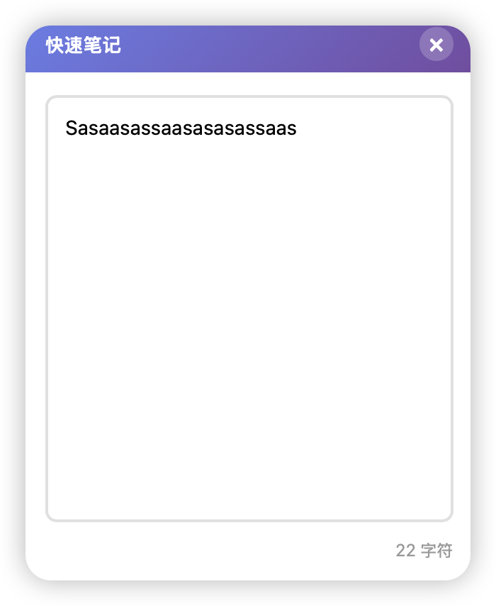

# QuickNote - macOS 快速笔记工具

✨ 一个轻量级的 macOS 菜单栏笔记应用，随时记录你的想法。




## ✨ 功能特性

- 🎯 **菜单栏常驻**：图标显示在 macOS 顶部菜单栏，随时可用
- 💾 **自动保存**：输入内容实时保存，永不丢失
- 🚀 **轻量快速**：不占用 Dock 空间，启动迅速
- 🖥️ **多桌面支持**：在所有工作空间都能访问
- 🎨 **简洁美观**：现代化的界面设计
- 🔒 **本地存储**：数据保存在本地，隐私安全

## 📦 安装使用

### 方式一：下载安装包（推荐）

1. 前往 [Releases](https://github.com/Sunny-117/quick-note/releases) 页面
2. 下载最新版本的 `.dmg` 文件
3. 打开 `.dmg` 文件，将 QuickNote 拖入应用程序文件夹
4. 启动应用，菜单栏会出现图标

### 方式二：从源码构建

**环境要求：**
- macOS 10.13+
- Rust（最新稳定版）

**构建步骤：**

```bash
# 1. 克隆仓库
git clone https://github.com/Sunny-117/quick-note.git
cd quick-note

# 2. 构建应用
cargo tauri build

# 3. 安装应用
open src-tauri/target/release/bundle/macos/QuickNote.app
```

## 🎮 使用方法

1. **打开面板**：点击菜单栏图标
2. **输入笔记**：在文本框中输入内容，自动保存
3. **关闭面板**：点击面板外任意区域，或点击右上角 × 按钮
4. **清空内容**：点击"清空"按钮
5. **退出应用**：右键点击菜单栏图标，选择"退出"

## 🛠️ 技术栈

- **[Tauri 2.0](https://tauri.app/)**：轻量级桌面应用框架
- **Rust**：高性能后端
- **HTML/CSS/JavaScript**：原生前端
- **localStorage**：本地数据持久化

## 🔧 开发

```bash
# 安装 Rust
curl --proto '=https' --tlsv1.2 -sSf https://sh.rustup.rs | sh

# 开发模式运行
cargo tauri dev

# 构建生产版本
cargo tauri build
```

## 📝 发布 Release

### 方式一：自动发布（推荐）

使用 GitHub Actions 自动构建和发布：

```bash
# 1. 创建并推送版本标签
git tag v1.0.0
git push origin v1.0.0

# 2. GitHub Actions 会自动构建并创建 Release
# 访问 https://github.com/Sunny-117/quick-note/actions 查看进度
```

### 方式二：使用发布脚本

```bash
# 安装 GitHub CLI（如果还没安装）
brew install gh
gh auth login

# 运行发布脚本
./scripts/release.sh v1.0.0
```

### 方式三：手动发布

```bash
# 1. 构建应用
cargo tauri build --target universal-apple-darwin

# 2. 创建压缩包
cd src-tauri/target/universal-apple-darwin/release/bundle/macos
tar -czf QuickNote.app.tar.gz QuickNote.app

# 3. 使用 GitHub CLI 创建 Release
gh release create v1.0.0 QuickNote.app.tar.gz --title "v1.0.0" --notes "Release notes"
```

## 📄 许可证

MIT License - 详见 [LICENSE](LICENSE) 文件

## 🤝 贡献

欢迎提交 Issue 和 Pull Request！

---

**Made with ❤️ for macOS users**
